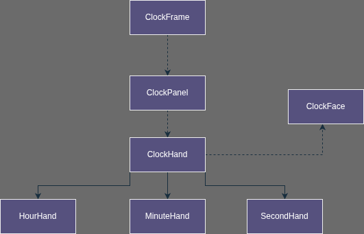

# Analog Clock Simulation Mykyta Korobko 240201342


A Java analog clock application that displays real-time system time using Swing graphics and OOP principles.## Project Overview

This project implements a functional analog clock with hour, minute, and second hands that update continuously. It was built as part of a Computer Engineering course to demonstrate object-oriented programming concepts including inheritance, encapsulation, polymorphism, and composition.The clock displays the current system time on a traditional circular clock face with numeric hour markings from 1 to 12. All three hands move smoothly to reflect the actual time, and the display updates automatically every second without requiring any user interaction.## Project Structure

```
src/
├── Main.java                      # Entry point
├── model/                     # Domain layer
│       ├── ClockHand.java        # Abstract base class
│       ├── HourHand.java         # Hour hand implementation
│       ├── MinuteHand.java       # Minute hand implementation
│       ├── SecondHand.java       # Second hand implementation
│       └── ClockFace.java        # Clock face and markings
├── service/                   # Business logic layer
│       └── TimeService.java      # Time retrieval service
└── ui/                        # Presentation layer
        ├── ClockFrame.java       # Main window
        └── ClockPanel.java       # Drawing panel
```
### UML Diagram


### Package Organization

The project follows a clean architecture pattern with three layers:

**model** - Contains all clock components and domain entities. The ClockHand abstract class serves as a base for HourHand, MinuteHand, and SecondHand. Each hand calculates its own angle based on the current time. ClockFace handles drawing the circular background, border, and hour markings.

**service** - Contains the TimeService class which retrieves the current system time using Java's LocalTime API. This separation allows us to change how time is obtained without affecting other parts of the code.

**utilities** - Handles all presentation logic. ClockFrame is the main window that extends JFrame. ClockPanel extends JPanel and is responsible for drawing all clock components by coordinating the clock face and hands.

## How It Works

### Time to Angle Conversion

The application gets the current time from the system and converts it to angles for each hand:

**Second Hand:**
```
angle = seconds * 6°
```
Since there are 60 seconds in a full rotation and 360 degrees in a circle, each second represents 6 degrees.

**Minute Hand:**
```
angle = minutes * 6°
```
Similarly, there are 60 minutes in a full rotation, so each minute is 6 degrees.

**Hour Hand:**
```
angle = (hour % 12) * 30° + minutes * 0.5°
```
There are 12 hours on a clock face, so each hour is 30 degrees. The minute contribution (0.5 degrees per minute) ensures the hour hand moves smoothly between hour markers instead of jumping abruptly.

### Coordinate Transformation

To actually draw the hands on screen, we need to convert polar coordinates (angle and length) to Cartesian coordinates (x, y). This is done using basic trigonometry:

```java
double radians = Math.toRadians(angle - 90);
int endX = centerX + handLength * cos(radians);
int endY = centerY + handLength * sin(radians);
```

The 90-degree adjustment is necessary because in standard math, 0 degrees points to the right (3 o'clock position), but on a clock, we want 0 degrees to point upward (12 o'clock position).

### Update Mechanism

The clock uses Java's Timer and TimerTask classes to handle updates. A Timer is created when the application starts, and it schedules a task to run every 1000 milliseconds (1 second). This task simply calls `repaint()` on the clock panel, which triggers the `paintComponent()` method to recalculate angles and redraw everything.

## Object-Oriented Design

The project demonstrates several OOP principles:

**Inheritance** - HourHand, MinuteHand, and SecondHand all extend the abstract ClockHand class. They inherit common properties like angle, length, width, and color, but each implements its own `updateAngle()` method with the appropriate calculation.

**Encapsulation** - Each class manages its own internal state. For example, each hand knows its own angle and how to calculate it. The UI layer doesn't need to know the calculation details.

**Polymorphism** - All hands can be treated uniformly as ClockHand objects, but each behaves differently when `updateAngle()` is called. This allows the ClockPanel to work with any type of hand without knowing the specific implementation.

**Composition** - ClockPanel contains instances of ClockFace and all three hand objects. These components work together to create the complete clock display.


## Building and Running

### Compilation

From the project root directory:

```bash
javac -d bin src/Main.java src/com/clock/model/*.java src/com/clock/service/*.java src/com/clock/ui/*.java
```

### Execution

```bash
java -cp bin Main
```

### Alternative Method

From the src directory:

```bash
cd src
javac Main.java com/clock/model/*.java com/clock/service/*.java com/clock/ui/*.java
java Main
```

## Requirements

- Java Development Kit (JDK) 8 or higher

## Technical Details

The clock face has a white background with a black border. Hour numbers are positioned around the circle using the same trigonometric calculations as the hands. Hour tick marks are drawn with a thick stroke, while minute ticks use a thinner stroke.

The graphics rendering uses Graphics2D with anti-aliasing enabled for smooth lines and curves. The clock automatically centers itself by calculating the panel's center point and adjusting the radius based on available space.

Each hand has its own length relative to the clock radius (hour: 50%, minute: 70%, second: 80%) and its own stroke width for visual distinction.


---

**Mykyta Korobko**